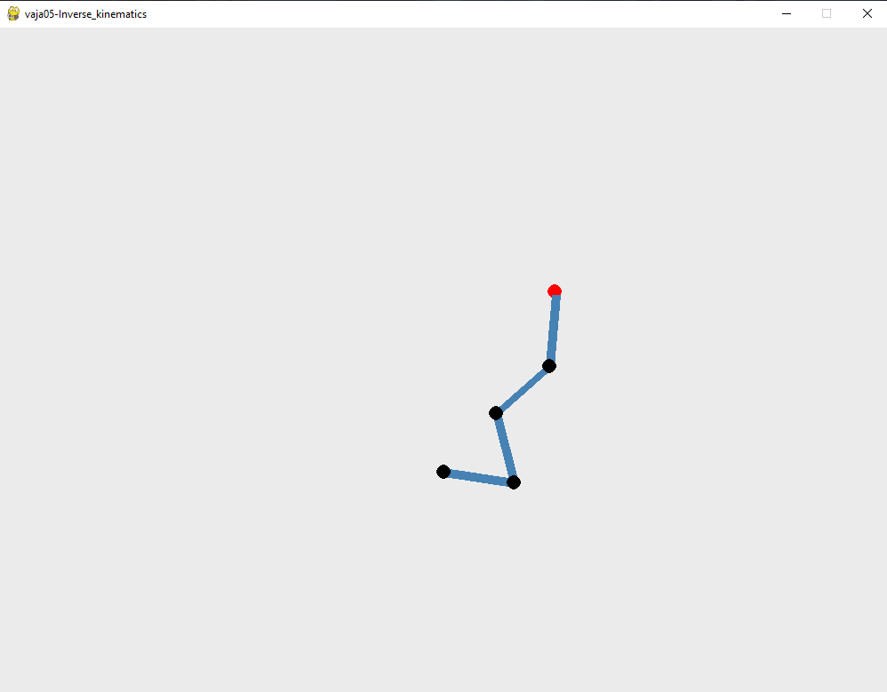

# vaja05_pygame_inverseKinematics

pygame_inverseKinematics is a Python implementation of inverse kinematics.

## Usage

```python
python game.py
```

## Preview


## License
[MIT](https://choosealicense.com/licenses/mit/)